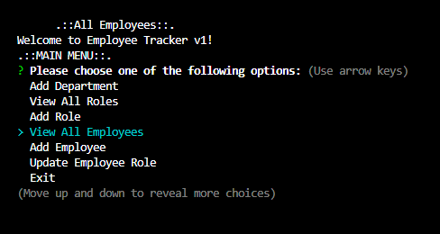

# Employee Tracker 

## Description
Uses MySQL, Node, and Inquirer to create a back-end application that helps a manager navigate through employees in a database.
## Deployed Application URL
https://youtu.be/OOgw_kSIc_A
## Screenshot

## Table of Contents
* [Features](#features)
* [Languages & Dependencies](#languagesanddependencies)
* [How to Use This Application](#HowtoUseThisApplication)
* [Contributors](#contributors)
* [Testing](#testing)
* [Questions](#questions)
## Features

## Languages & Dependencies
mysql2, inquirer, console.table
## How to Use This Application:
SQL, ES6 JavaScript
## Contributors

## Testing

## Questions
Please send your questions [here](mailto:william@fleato.com?subject=[GitHub]%20Dev%20Connect) or visit [github/dopecello](https://github.com/dopecello).
